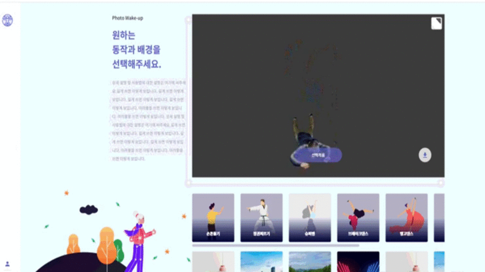

# NIA2020PhotoWakeUpService


## Introduction
한국지능정보사회진흥원(NIA)의 시범서비스 과제로 구축한 Photo wake-up 서비스입니다.

## Git Clone
```sh
git https://github.com/sweetkco/NIA2020PhotoWakeUpService.git
```

# Model Part (only Linux)

## Installation and running

photowakeup 폴더 안에서

### 라이브러리 설치
```sh
pip install -r requirements.txt
```
모델 다운로드 및 배치<br>
[다운로드](https://sweetkco-my.sharepoint.com/:u:/g/personal/hanjoon_choe_sweetk_co_kr/ESOFCB7y40JPqKs3v6Z8RuIB7XFnBrApyTjN2KAAXTo5aA?e=41568g)
```
다운 받은 모델들을 /photowakeup/checkpoints로 이동시킨다.
```
### 장고 세팅 및 서버 실행
```sh
python manage.py makemigrations
python manage.py migrate
python manage.py runserver 0.0.0.0:{Port} --noreload
```

# User Interface Part (only Windows)

## Setting and running

photowakeup_ui 폴더 안에서

### app.properties 수정 

내용을 다음과 같이 해당 경로 수정
```sh
ai_upload_url=http://"ip_address from model part":19020/input_images/
ai_download_url=http://"ip_address from model part:19020/photo_wake_up/
ui_exec_path=C:\\your directory\\photowakeup_ui\\sweek_test_03.bat
download_dir=C:\\your directory\\Desktop\\photowakeup_ui\\verge3d_blender
```

### war 파일 실행

커맨드 창에서
```sh
java -jar photowakeup-1.0.jar
```
실행

### 웹페이지 접속
```sh
http://해당 윈도우 아이피:8668/applications/Sweetk/index.html
```

### 이미지 업로드
```
이미지 업로드 버튼을 누른후 
hyeokmin_front.jpeg
로 명명한 정면 이미지 사진을 업로드
```

#### 이미지 업로드 시 주의사항

> T포즈에 가까운 1024x1024 이상 사이즈의 고해상도 사람 이미지 앞 뒤(.jpeg)<br>
> 완전히 T포즈의 이미지를 넣을 경우 3d mesh가 불완전하게 형성 될 수 있음.<br>
> 인물 주변에 옷가지들이 들어 있으면 안됨<br>
> 배경은 깨끗할수록 좋음


## Citations
```
@article{li2019self,
  title={Self-Correction for Human Parsing},
  author={Li, Peike and Xu, Yunqiu and Wei, Yunchao and Yang, Yi},
  journal={arXiv preprint arXiv:1910.09777},
  year={2019}
}
```
```
@inProceedings{kanazawaHMR18,
  title={End-to-end Recovery of Human Shape and Pose},
  author = {Angjoo Kanazawa
  and Michael J. Black
  and David W. Jacobs
  and Jitendra Malik},
  booktitle={Computer Vision and Pattern Recognition (CVPR)},
  year={2018}
}
```
```
@inproceedings{saito2020pifuhd,
  title={PIFuHD: Multi-Level Pixel-Aligned Implicit Function for High-Resolution 3D Human Digitization},
  author={Saito, Shunsuke and Simon, Tomas and Saragih, Jason and Joo, Hanbyul},
  booktitle={CVPR},
  year={2020}
}
```
```
@inproceedings{osokin2018lightweight_openpose,
    author={Osokin, Daniil},
    title={Real-time 2D Multi-Person Pose Estimation on CPU: Lightweight OpenPose},
    booktitle = {arXiv preprint arXiv:1811.12004},
    year = {2018}
}
```
